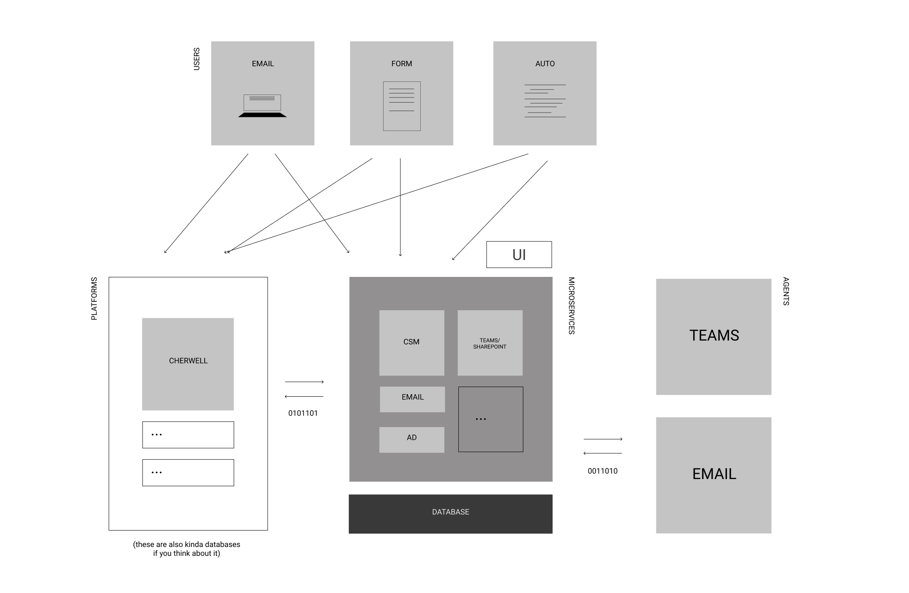

# ARCHITECTURE <!-- {docsify-ignore} -->
With the architecture for POLUS, there were three goals in mind: modular, extensibility, and web-first.

*modular* - POLUS uses a microservice architecture, meaning each service added to POLUS has its own API endpoints and talk to each other. For instance, for the UI parts of the project, a call for the dashboard makes several other API calls to the Cherwell service to retrieve the data it needs, then the call is returned to the user. This way, services can be maintained independently.

*extensible* - Also since it’s built this way, it’s further extensible with new modules whenever a new service comes along, or if a software product changes. POLUS is agnostic, and built to integrate.

*web-first* - Most of the project is an API. On the client side there’s a web app that serves the end-users, which can essentially be a Progressive Web App. The user experience is web-first, and will work in any browser supporting Javascript. No native apps are needed, but building web-first leaves the option open. 

## client
The client user experience - which is the what end-users and agent-users will interact with - is a web app built with Vue. The web app consumes the endpoints created server-side and displays the information to the user. It is developed separately from the server, and can be iterated on its own timeline. 

End-users will be able to make requests, and agent-users are able to handle those requests as well as other tasks or related items to their work.

## server
On the server sits a NodeJS app. It’s a REST API that is built to handle three types of requests: either to a **service**, to fire an **event**, or issue a **command**.

More importantly, each module is built as a *microservice*, so that they have their own endpoints, can communicate with each other if needed, and can be developed independently. For example, if a JIRA operation included modifying a Cherwell ticket, the operation would make that call to an endpoint on the Cherwell module and do the thing. If the Cherwell part breaks, you know it’s not in your JIRA module.

Here’s what it looks like from a top-level view.

End-users will be able to make requests and communicate through a variety of ways. POLUS can handle those requests and any other operations needed to complete the request. 

Agent-users interface with the end-users through different ways also. POLUS can meet people where they are through building integrations with Microsoft Teams - and other software products for communication - or use email as they currently do.

The UI acts as a service in POLUS. It handles the serving of forms for user requests and other experiences for agent-users, like tickets, tasks and dashboards.

