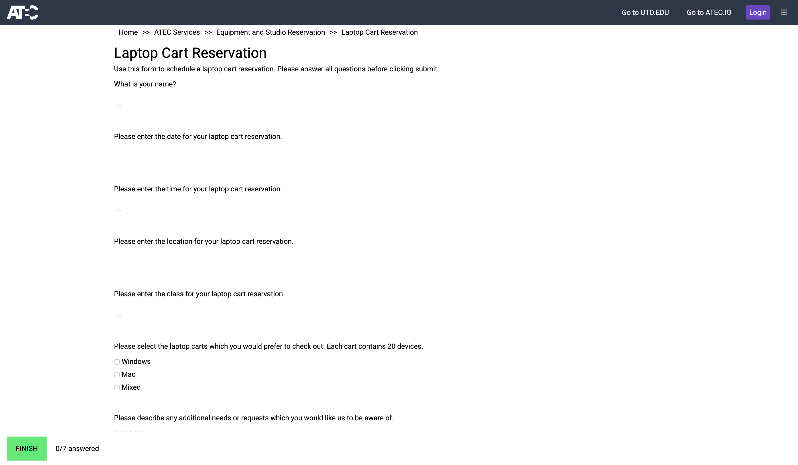
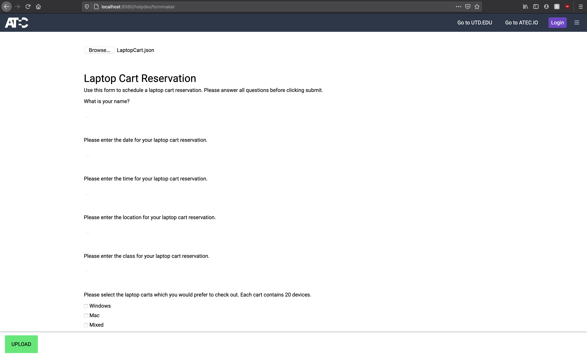
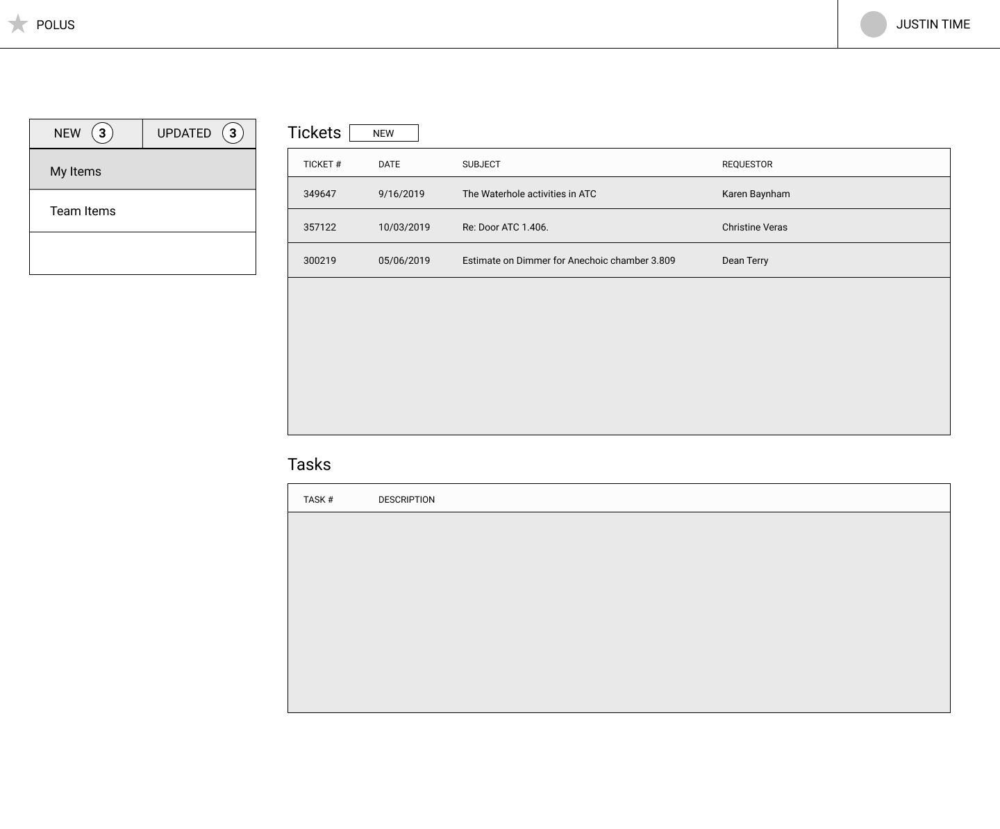
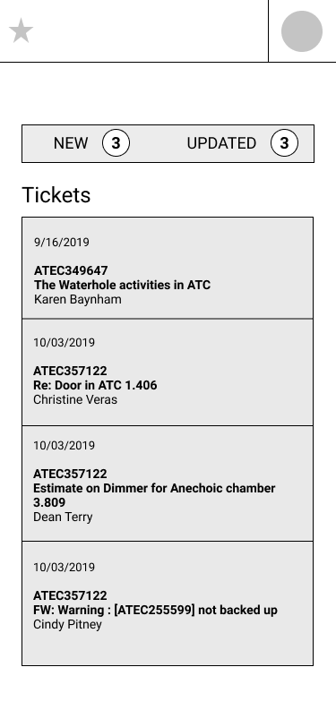
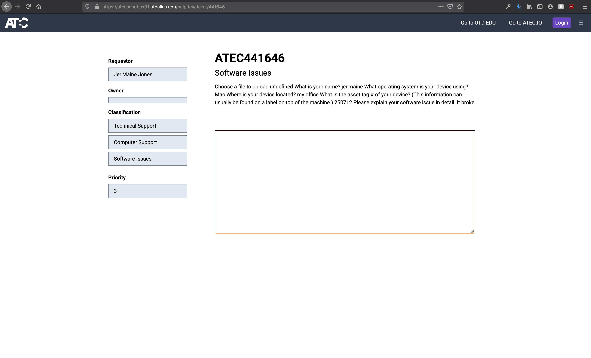
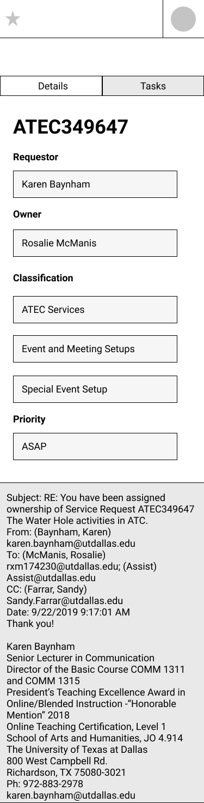

# PROTOTYPE <!-- {docsify-ignore} -->

A POLUS prototype is currently in development.

The features implemented during the prototyping phase consisted of
- basic CRUD operations for the creation of forms, on the server
- user form submission and ticket creation workflow for use with online processes
- integration of Cherwell for ticketing
- Read-only views for agent-user dashboards, Cherwell tickets and tasks

## PHASE 000: Forms

POLUS began as a way to easily create and serve forms for ATEC'S online processes. With Cherwell's API allowing developers to create, read and update business objects, an HTML form can be sent to Cherwell creating a ticket with a classification and team assignment. 

Forms on the server are JSON objects containing the details of the form and an array of queries. The form queries use the standard HTML form inputs, with the ability to add subqueries for related information.

The first version was deployed on ATEC's local servers for testing, and a form maker was made to quickly upload new forms.

## PHASE 001: Ticketing 

The next phase of the prototype focused on ticketing experience functionality. Currently in a read-only state, the functionality looks to be similar to a Zendesk-like workflow -- with a dashboard showing tickets and tasks available to the agent-user, and the ability to view items by grouping. 

### Dashboard

Cherwell tickets and tasks are populated in list view. The sidebar's buttons will filter the widgets on the dashboard.

### Tickets

Clicking on a listing in the ticket widget on a dashboard, or navigating to the ticket if you know the ticket number, gives a view of the ticket and its info, from the latest email from the end-user to any tasks that may be associated with the ticket.

### Tasks

Tasks work in the same way, showing the details of a task.

